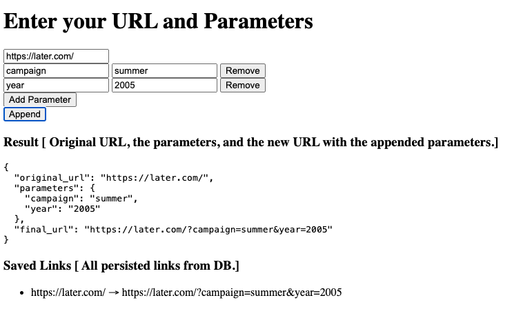

# URL Appender

# Table of Contents

1. [Introduction](#markdown-header-introduction)
2. [System Requirements](#markdown-header-system-requirements)
3. [Local Setup](#markdown-header-local-setup)
4. [Trello Task list](#markdown-header-trello)


# Introduction

URL Appender is a full-stack application that works like a 'Link in Bio' tool that takes URL and parameters to be appended, and returns the modified URL back. This also uses a DB implementation to store links.

# System Requirements

* Git
* Node Version Manager / Node

# Local Setup

1. Clone the repository on your system:
    ```sh
    $ git clone git@github.com:JagjitUvic/url-appender.git
    ```

2. Go inside the front-end folder to start the typescript via npm commands
    ```sh
    $ cd url-appender/src/typescript-frontend-app
    $ npm install
    $ npm run dev
    ```

3. Go inside the back-end folder to start the node server via npm commands
    ```sh
    $ cd url-appender/src/nodejs-backend-app/
    $ npm install
    $ npm start
    ```

4. Go to the localhost URl received in step 2, this is the place where you can use this application.



# Trello 

The task list for this small project is stored and managed by [Trello Board](https://trello.com/b/4Ig8x13k/url-append)
